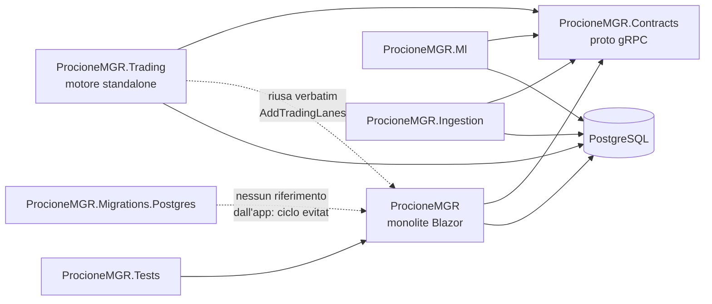

# 01 — PROJECT MAP

Mappa navigabile del progetto. Per l'elenco esaustivo e sintetico di **tutti** i file vedi
[10_FILE_INVENTORY.md](10_FILE_INVENTORY.md); qui ogni file significativo ha ruolo, layer, tipi
principali, dipendenze, cosa produce/consuma, stato e note.

**Legenda stato:** `Implemented` completo e cablato · `Partial` funzionante ma con rami non
raggiungibili · `Stub` scheletro · `Mock` finto per test · `Disconnected` completo ma non raggiungibile
dal runtime dell'app · `Dead` nessun riferimento · `Deliberately-Off` completo, cablato, spento per
decisione documentata.

**Legenda layer:** `UI` · `App` (orchestrazione/page service) · `Domain` (logica pura) · `Infra`
(DB/rete/exchange) · `ML` · `Data` · `Risk` · `Exec` · `Test` · `Config` · `Docs` · `Scripts`.

---

## 0. Struttura della solution

`ProcioneMGR.sln` — 7 progetti + 5 tool CLI fuori solution build principale.

| Progetto | Ruolo | Layer | Righe `.cs` | Stato |
|---|---|---|---|---|
| `ProcioneMGR/` | **Monolite**: UI Blazor Server + tutta la logica quant + guscio dei worker | UI/App/Domain/ML/Risk | 72.824 tot. area | Implemented |
| `ProcioneMGR.Contracts/` | Contratti gRPC condivisi (`.proto`) + interceptor segreto condiviso | Infra | 42 | Implemented |
| `ProcioneMGR.Trading/` | **Motore di trading standalone** (host gRPC, Fase 2b microservizi) | Exec | 514 | Implemented |
| `ProcioneMGR.Ml/` | Servizio inferenza ML remoto (dual-read osservativo) | ML | 166 | Deliberately-Off (`Ml:Enabled=false`) |
| `ProcioneMGR.Ingestion/` | Servizio ingestione OHLCV remoto | Data | 81 | Deliberately-Off (`UseRemoteIngestion=false`) |
| `ProcioneMGR.Migrations.Postgres/` | Migrazioni EF Core (42 file) | Data | — | Implemented |
| `ProcioneMGR.Tests/` | 262 file di test, 53.700 righe | Test | — | Implemented |
| `tools/PlatformExpand/` | CLI di ricerca, 5.848 righe in un solo `Program.cs` | Domain | 5.848 | ⚠️ vedi G-09 |
| `tools/StrategyHunter/`, `SpotVerify/`, `FuturesVerify/`, `DbBackup/` | utility CLI | Scripts | 784 | Implemented |

### Grafo delle dipendenze fra progetti



> **Nota architetturale non ovvia:** `ProcioneMGR` **non** referenzia
> `ProcioneMGR.Migrations.Postgres` (eviterebbe un ciclo). Le migrazioni si applicano all'avvio
> caricando l'assembly **per nome** — vedi `Data/DatabaseMigrator.cs` e `Program.cs:664-682`.

---

## 1. Bootstrap e composizione (layer: Config)

| File | Ruolo | Tipi | Produce / Consuma | Stato | Note e rischi |
|---|---|---|---|---|---|
| `ProcioneMGR/Program.cs` (706 righe) | **Composition root n.1**. Registra ~120 servizi, 17 hosted service, Identity, DataProtection, OTel | — | consuma `IConfiguration`; produce il contenitore DI | Implemented | Molto commentato: ogni registrazione dichiara il perché. È il documento più affidabile sul wiring |
| `ProcioneMGR/Services/Trading/TradingServiceCollectionExtensions.cs` (360) | **Composition root n.2**: corsie di trading keyed per `LaneId` | `TradingServiceCollectionExtensions` | produce `ITradingEngine`/`IEnsembleManager` keyed | Implemented | Qui vive l'invariante "un solo scrittore per corsia", garantita per **registrazione condizionale**, non per lock |
| `ProcioneMGR/Data/DatabaseServiceCollectionExtensions.cs` | `AddProcioneDatabase`: `IDbContextFactory` condiviso con gli host satellite | — | produce factory DbContext | Implemented | |
| `ProcioneMGR/Data/DatabaseMigrator.cs` | Migrate-on-startup con advisory lock | `MigrationOutcome` | applica migrazioni | Implemented | `MigrationOutcome` risulta non referenziato (uso via `var`) |
| `ProcioneMGR/Services/Ingestion/IngestionServiceCollectionExtensions.cs` | `AddOhlcvIngestion` + `ExchangeClockSyncWorker` | — | | Implemented | |
| `ProcioneMGR/Services/Notifications/NotificationServiceCollectionExtensions.cs` | `AddProcioneNotifications` (Logging/Telegram) | — | | Deliberately-Off (`Notifications:Enabled=false`) | |
| `ProcioneMGR/Services/Observability/ObservabilityExtensions.cs` | `AddProcioneObservability` export OTLP | — | | Deliberately-Off (`Observability:Enabled=false`) | |
| `ProcioneMGR/appsettings.json.example` | Template dei default | — | | Implemented | ⚠️ **`DriveProtectiveExits=true`** contraddice la regola 7 di `CLAUDE.md` → C-02 |
| `ProcioneMGR/appsettings.json.pre-audit-test-20260729-141448` | Backup datato **tracciato da git** | — | | 🔴 **Da rimuovere** | Contiene MasterKey, GrpcSharedSecret, password DB → C-01 |
| `ProcioneMGR/Config/pipeline_rules.json` | Soglie dei gate della pipeline | — | consumato da `PipelineRulesProvider` | Implemented | |

---

## 2. Persistenza (layer: Data)

`ProcioneMGR/Data/` — 23 file, 1.731 righe. `ApplicationDbContext` espone **34 `DbSet`**.

| Entità | File | Scritta da | Letta da | Stato |
|---|---|---|---|---|
| `OhlcvData` | `Data/OhlcvData.cs` | `MarketDataSyncWorker`, `IOhlcvIngestionService` | tutta la catena quant | Implemented |
| `TrackedSeries` | `Data/TrackedSeries.cs` | `/market/watchlist` | sync worker, freshness watch | Implemented |
| `SavedStrategy` / `SavedMlModel` / `SavedFactor` | `Data/Saved*.cs` | pagine Backtest/ML/Feature | `/strategies`, registry | Implemented |
| `EnsembleState`, `EnsembleRebalanceHistory` | `Data/EnsembleState.cs` | `EnsembleManager`, `PipelineApplier` | `TradingEngine`, `/ensemble` | Implemented |
| `TradingEngineState`, `Order`, `OpenPosition`, `TradeRecord`, `TradingAuditLog` | `Services/Trading/TradingEntities.cs`, `TradingModels.cs` | `TradingEngine` (unico scrittore) | `/trading`, diagnostica | Implemented |
| `LaneQuarantine` | `Services/Trading/TradingEntities.cs` | `LaneInvariantWatchdog` | `/trading`, Fleet | Implemented |
| `ExecutionJob` | `Services/Trading/ExecutionJobModels.cs` | `ExecutionSlicePlanner` | `ExecutionWorker` | Implemented |
| `ProtectiveExitShadow` | `Services/Trading/ProtectiveExitShadow.cs` | `ProtectiveExitShadowRecorder` | `ProtectiveExitLagAnalyzer` | Implemented |
| `PipelineRun`, `PipelineArtifact`, `PipelineConfiguration`, `VettingCampaign` | `Services/Pipeline/PipelineEntities.cs`, `CampaignEntities.cs` | `PipelineEngine`, `CampaignPlanner` | `/pipeline`, `/campaign` | Implemented |
| `ExperimentRun`, `ExperimentArtifact` | `Services/Experiments/ExperimentEntities.cs` | `ExperimentTracker` | `/experiments` | Implemented |
| `DriftCheckResult` | `Services/Monitoring/Drift/DriftModels.cs` | `FeatureDriftWorker` | `/admin/autonomy` | Implemented |
| `FactorIcWindow` | `Services/Alpha/FactorIcHistory.cs` | `FactorDriftWorker` | Home, `/feature-selection` | Implemented |
| `RegimeModel` | `Services/Regime/RegimeModels.cs` | `RegimeRetrainingWorker` | `RegimeDetector`, `/regimes` | Implemented |
| `SentimentMetricPoint` | `Data/SentimentMetricPoint.cs` | `SentimentSyncWorker`, `LiquidationSyncWorker` | carry, funding backtest, `/sentiment` | Implemented |
| `AltDataPoint` | `Data/AltDataPoint.cs` | `AltDataSyncService` | `/sentiment` | Implemented |
| `ExchangeCredential`, `ExchangeCredentialCiphertext` | `Data/ExchangeCredential*.cs` | `/settings/exchanges` | `ExchangeCredentialReader` | Implemented (cifrate AES-GCM) |
| `AiCredential`, `LlmUsageRecord` | `Data/AiCredential.cs`, `LlmUsageRecord.cs` | `/admin/ai-supervisor`, `LlmUsageTracker` | `AiKeyStore`, budget guard | Implemented |
| `OrchestratorDecision` | `Data/OrchestratorDecision.cs` | `FleetOrchestratorWorker` | `/admin/autonomy` | Deliberately-Off |
| `TradePostMortem` | `Data/TradePostMortem.cs` | `PostMortemWorker` | `/admin/ai-supervisor` | Deliberately-Off |
| `HostHeartbeat` | `Data/HostHeartbeat.cs` | `HostHeartbeatWorker` | `HeartbeatMonitorWorker` | Deliberately-Off |
| `UserPageConfig` | `Data/UserPageConfig.cs` | `PageConfigStore` | tutte le pagine con preset | Implemented |

---

## 3. Macchina quantitativa — mappa per modulo

> Dettaglio funzionale in [03_DOMAIN_QUANT_MACHINE.md](03_DOMAIN_QUANT_MACHINE.md), dettaglio
> algoritmico in [04_ALGORITHMS_AND_MODELS.md](04_ALGORITHMS_AND_MODELS.md).

### 3.1 `Services/Alpha/` — fattori e IC (14 file, 2.831 righe) · layer Domain

| File | Tipi principali | Ruolo | Stato |
|---|---|---|---|
| `Alpha158/Alpha158Catalog.cs` (172) | `Alpha158Catalog`, `Alpha158Factor`, `OpDescriptor` | Catalogo Alpha158 stile qlib: pochi operatori × molti orizzonti | Implemented |
| `Alpha158/RollingOps.cs` (518) | `RollingOps`, `Bars` | Operatori rolling causali (no lookahead) | Implemented |
| `AlphaFactorFactory.cs` (94) | `IAlphaFactorFactory` | **Punto di innesto**: prototipi = 8 fattori a mano + intero catalogo Alpha158 (riga 60); ramo sentiment opzionale (riga 70) | Partial (ramo sentiment spento) |
| `Factors.cs` (308) | 8 fattori: Momentum, MeanReversion, RealizedVol, ParkinsonVol, RelativeVolume, RSI, MACD, DistanceFromMA | Fattori scritti a mano | Implemented |
| `OrderFlowFactors.cs` (115) | `TakerImbalanceFactor`, `AvgTradeSizeFactor` | Fattori di flusso | Implemented |
| `FactorEvaluator.cs` (192) | `FactorEvaluator` | IC, IR, quantile returns | Implemented |
| `FactorDriftAnalyzer.cs` (281) | `IFactorDriftAnalyzer` | Deriva e persistenza dell'IC | Implemented |
| `FactorDriftMonitor.cs` (335) | `FactorDriftSnapshot`, `FactorDriftWorker` | Job periodico + fotografia in memoria | Implemented |
| `FactorIcHistory.cs` (298) | `IFactorIcHistoryStore` | Storia IC su tabella | Implemented |
| `FactorCache.cs` (114) | `IFactorCache` | Cache condivisa training/inferenza | Implemented |
| `FactorMath.cs` (106) | `FactorMath` | Statistica di supporto | Implemented |

⚠️ `FactorDriftMonitor.cs:105` esclude **deliberatamente** i 158 fattori Alpha158 dal monitor di
deriva (costo: 158 × N serie × finestre). Conseguenza dichiarata: **la deriva dei fattori Alpha158
non è sorvegliata**.

### 3.2 `Services/ML/` — modelli (37 file, 5.234 righe) · layer ML

| File | Tipi | Ruolo | Stato |
|---|---|---|---|
| `DatasetBuilder.cs` + `IDatasetBuilder.cs` | `DatasetBuilder` | fattori → matrice X/y, con `RegimeAugmentation` | Implemented |
| `PurgedTimeSeriesCv.cs` (41) | `IPurgedTimeSeriesCv` | CV temporale purged + embargo | Implemented |
| `LinearReturnPredictor.cs` (20) | | OLS/ridge | Implemented |
| `RandomForestReturnPredictor.cs` (32) | | ML.NET FastForest | Implemented |
| `GradientBoostingReturnPredictor.cs` (36) | | ML.NET FastTree (ruolo "LightGBM") | Implemented |
| `MlpReturnPredictor.cs` (298) | | MLP scritta a mano | Implemented |
| `AttentionReturnPredictor.cs` (559) | | Attention su finestre di sequenza | Implemented |
| `StackedReturnPredictor.cs` (428) | `StackingMode` | Ensemble di predittori | Implemented |
| `ReturnPredictorCatalog.cs` (23) | | Catalogo esposto alla UI | Implemented |
| `RegressionPredictorBase.cs` (180) | `IShapExplainable` | Base comune | Implemented |
| `Shap/` (4 file, 794) | `TreeShapExplainer`, `ShapAnalyzer`, `MlNetTreeExtractor`, `ShapTree` | Spiegazione SHAP degli alberi | Implemented |
| `Labeling/` (4 file, 836) | `TripleBarrierLabeler`, `MetaLabeler`, `MetaModelTrainer`, `MetaLabelingAnalysisService` | Triple-barrier + meta-labeling (López de Prado) | Implemented |
| `RiskFactorPca.cs` + `IRiskFactorPca.cs` | | PCA sui fattori di rischio | Implemented (solo `/portfolio`) |
| `HierarchicalClustering.cs` (105) | `LinkageMethod`, `CorrelationDistance` | Clustering per HRP | Implemented |
| `MlLabService.cs` (808) | `MlLabService` | Orchestrazione di `/ml` | Implemented |
| `MlComparisonClient.cs` | `IMlComparisonClient` | Dual-read gRPC verso `ProcioneMGR.Ml` | Deliberately-Off |
| `MlTargetKind.cs` (82) | `MlTargetKind`, `ForwardTargets` | Tipo di target (rendimento, vol, ecc.) | Implemented |
| `VolForecastEvaluator.cs` (135) | | QLIKE e metriche di previsione vol | Implemented |
| `SequenceWindowing.cs` (83) | | Finestre per l'attention | Implemented |

### 3.3 `Services/Regime/` (12 file, 2.088 righe) · layer Domain

| File | Ruolo | Stato |
|---|---|---|
| `RegimeDetector.cs` (548) | K-means sui feature di mercato — **il rilevatore in esercizio** | Implemented |
| `MarketFeatureExtractor.cs` (215) | Feature per la classificazione | Implemented |
| `MarketBreadthCalculator.cs` (76) | Breadth interna | Implemented |
| `RegimeAssignment.cs` (192) | Assegnazione stabile dei regimi | Implemented |
| `RegimeAugmentation.cs` (76) | One-hot del regime nel dataset ML | Implemented |
| `LaneRegimeRouter.cs` (265) | Filtra quali strategie operano nel regime corrente | Deliberately-Off (`DriveDecisions=false`) |
| `RegimeRetrainingWorker.cs` (98) | Riaddestramento periodico | Implemented |
| **`JumpModel.cs` (288)** | Modello di regime con penalità di salto | 🔴 **Dead** — solo test |

### 3.4 `Services/Backtesting/` (24 file, 3.674 righe) · layer Domain

`BacktestEngine.cs` (692) è il motore. 14 strategie concrete implementano `IStrategy`
(`EmaCross`, `RsiOversold`, `Momentum`, `MacdTrend`, `PriceSmaCross`, `BollingerMeanReversion`,
`DonchianBreakout`, `GridMeanReversion`, `Stochastic`, `Supertrend`, `VwapReversion`,
`RegimeConditional`, `CompositeSignal`, `EventTrigger`, `MlStrategy`), tutte esposte da
`StrategyFactory` → UI. `SignalCatalog.cs` (394) è il vocabolario dei segnali componibili.

### 3.5 `Services/Validation/` (10 file, 1.154 righe) · layer Domain — **anti-overfitting**

| File | Ruolo | Stato |
|---|---|---|
| `DeflatedSharpeRatio.cs` (160) | DSR di Bailey/López de Prado | Implemented |
| `NullTwinGenerator.cs` + `NullTwinJudge.cs` (255) | Gemello nullo, giudice unico (200 gemelli, 99°) | Implemented |
| `CombinatorialPurgedCv.cs` (106) | CPCV | Partial — la classe è usata, **`ICombinatorialPurgedCv` non è registrata né implementata altrove** |
| `BacktestOverfitting.cs` (103) | PBO | Implemented |
| `EffectiveTrials.cs` (100) | Prove effettive per il DSR | Implemented |
| `MinTrackRecord.cs` (96) | MinTRL | Implemented |
| `GatePowerAnalyzer.cs` (192) | Potenza statistica dei gate (F4) | Implemented |
| `PermutationTest.cs` (68) | Test di permutazione | Implemented |
| `SelectionValidator.cs` (74) | Validazione della selezione | Implemented |

### 3.6 `Services/Portfolio/` (6 file, 559 righe) · layer Risk

| File | Consumatore reale | Stato |
|---|---|---|
| `HierarchicalRiskParityOptimizer.cs` (82) | `/portfolio` **+ `DecisionStages.cs:90` (pipeline → ensemble)** | Implemented |
| `MeanVarianceOptimizer.cs` (53) | **solo** `/portfolio` | 🟡 Disconnected dall'operatività |
| `RiskParityOptimizer.cs` (37) | **solo** `/portfolio` | 🟡 Disconnected dall'operatività |
| `PortfolioMath.cs` (218), `ReturnMatrixBuilder.cs` (94), `IPortfolioOptimizer.cs` (75) | supporto | Implemented |

### 3.7 `Services/TimeSeries/` (8 file, 718 righe) · layer Domain

`GarchModel.cs` (GARCH(1,1)), `EngleGrangerCointegrationTest.cs` (196),
`HarRvForecaster.cs` (159, usato da `AnalysisStages.cs:295`), `OlsRegression.cs`,
`PairsSpreadAnalyzer.cs`. **GARCH non entra nel sizing**: scelta dichiarata in
`Trading/Internal/VolatilityScaler.cs` (non validato per quell'uso).

### 3.8 `Services/PairsTrading/` (7 file, 721 righe) · layer Domain

`PairsBacktestEngine.cs` (284) con due stimatori dell'hedge ratio: rolling OLS e
**Kalman** (`KalmanPairsSpreadAnalyzer.cs`, selezionato a riga 39). Consumato da `/pairs-trading` e
da `PairsScreeningStage`.

### 3.9 `Services/Microstructure/` (6 file, 1.166 righe) · layer Domain — 🔴 **ISOLA**

| File | Ruolo | Stato |
|---|---|---|
| `IncrementalIcGate.cs` (467) | Gate: il fattore aggiunge IC **oltre** a quelli già presenti? | 🔴 Disconnected |
| `BinanceDumpDownloader.cs` (177) + `BinanceDumpParser.cs` (201) | Scarico e parsing dei dump storici (tape, profondità) | 🔴 Disconnected |
| `TapeAggregator.cs` (110) | Aggregazione del tape in barre | 🔴 Disconnected |
| `OrderFlowImbalance.cs` (100) | OFI | 🔴 Disconnected |
| `MicrostructureModels.cs` (111) | `AggTrade`, `TapeBar`, `BestQuote`, `BookDepthSnapshot` | 🔴 Disconnected |

**Zero registrazioni DI · zero riferimenti dalla UI · unico consumatore `tools/PlatformExpand`.**

### 3.10 `Services/Sentiment/` (21) + `Services/AltData/` (7) — 2.893 righe

Tre scorer dietro `ISentimentScorer` con delegante hot-reload: `KeywordSentimentScorer` (default),
`LlmSentimentScorer`, `OnnxSentimentScorer` (pilota). Metriche di mercato (`FearGreedClient`,
`BinanceFuturesSentimentClient`) → `SentimentMetricPoint`. **`SentimentFeatureFactor` raggiunge
`AlphaFactorFactory` ma è gated da `EnableMlFeature=false`.**

---

## 4. Trading ed esecuzione (layer Exec/Risk) — 62 file, 9.465 righe

| File | Ruolo | Stato | Note safety |
|---|---|---|---|
| `TradingEngine.cs` (1.668) | Il motore: candela → segnale → ordine → posizione | Implemented | **Unico punto che valuta `SafetyChecker`** (riga 956) |
| `SafetyChecker.cs` (122) | **Statico e puro**: 6+ controlli di sicurezza | Implemented | Non iniettabile per progetto (regola 1) |
| `SafetyConfiguration.cs` (130) | Soglie | Implemented | |
| `LaneSafetyMonitor.cs` (70) | Soglie **effettive per corsia** (profilo di rischio sovrapposto) | Implemented | Implementa `IOptionsMonitor<SafetyConfiguration>`: entra al posto del monitor globale ovunque |
| `Internal/PositionOpener.cs` (413) | Apertura, con `FillSanityCheck` | Implemented | |
| `Internal/PositionCloser.cs` (367) | Chiusura | Implemented | Dichiara di saltare l'anti-spam n.6 (solo percorso di apertura) |
| `Internal/ExecutionSlicePlanner.cs` (124) | Piano a fette → `ExecutionJob` | Implemented | **Secondo punto `SafetyChecker.Evaluate`** (riga 54) |
| `Internal/ProtectiveExitEvaluator.cs` (134) | SL/TP/trailing | Implemented | |
| `Internal/FillSanityCheck.cs` (57) | Blocca i fill patologici (bug B1) | Implemented | |
| `Internal/VolatilityScaler.cs` (105) | Dosaggio sulla vol **realizzata** | Implemented | Può solo **ridurre** (`MaxExposureMultiplier=1,0`) |
| `Internal/BracketOrderManager.cs`, `AutoStopApplier.cs`, `OrderReconciler.cs`, `FuturesPositionReconciler.cs`, `ExecutionQuality.cs`, `SignalOrderBuilder.cs`, `TradingPersistence.cs` | supporto motore | Implemented | |
| `TradingWorker.cs` (193) | Scheduling per candela + **lease per corsia** | Implemented | |
| `ExecutionWorker.cs` (49) | Esecuzione delle fette | Implemented | |
| `LaneInvariantWatchdog.cs` (265) | Invarianti contabili → quarantena | Implemented | Uno per flotta, solo dove il motore è locale |
| `LaneExecutionLease.cs` (109) | **Advisory lock Postgres** per corsia | Implemented | L'invariante "un solo esecutore" applicata dal DB |
| `PromotionEvaluator.cs` (273) + `LanePromoter.cs` + `PromotionWorker.cs` | Paper→Testnet automatico; Live→Testnet solo retrocessione | Implemented | **Nessun percorso verso Live** |
| `Commands/` (7) + `Queries/` (5) + `Behaviors/` | CQRS Mediator | Implemented | Tutti usati da `TradingPageService` |
| `TradingPageService.cs` (571) | Orchestrazione di `/trading` | Implemented | 14 `mediator.Send(...)` |
| `RemoteTradingEngineClient.cs` (180) | Client gRPC verso il motore standalone | Deliberately-Off | |
| `EngineConfigStore.cs` (268) | Config del motore: locale o via gRPC | Implemented | |
| `ProtectiveExitShadow.cs` / `ProtectiveExitLagAnalyzer.cs` (553) | Sentinella d'ombra e misura del ritardo (B3) | Implemented | |

`Services/Execution/` (5 file, 470): `ImmediateExecutionAlgorithm`, `Twap`, `Vwap`, `Iceberg`,
`Adaptive` + `ExecutionSimulator`. **Nested execution collegata**: `TradingEngine` riceve
`IExecutionAlgorithmFactory` (costruttore, riga 46) e pianifica via `ExecutionSlicePlanner`.

`Services/Carry/` (5 file, 573): forward test carry delta-neutro. `CarryMode` contiene
**solo `Paper` e `Testnet`** — Live escluso a livello di tipo. `Deliberately-Off` (`Carry:Enabled=false`).

`Services/Fleet/` (5 file, 978): orchestratore Queen Bee. `Deliberately-Off` e, anche acceso,
`DryRun=true`.

---

## 5. Pipeline autonoma (28 file, 6.340 righe) · layer App

`PipelineEngine.cs` (572) esegue 19 stage in ordine dichiarato da `PipelineStageCatalog.cs:16-40`:

```
DataIngestion → PowerCheck → AltDataSync → FeatureEngineering → RegimeAnalysis →
VolatilityRegime → PairsScreening → MlModelTraining → StrategyDiscovery → CreativeDiscovery →
HoldoutValidation → NullTwinValidation → RobustnessProbe → EnsembleAssembly → RiskSizing →
NewsImpactCheck → Recommendation → ExecutionPlan
```

| File | Ruolo | Stato |
|---|---|---|
| `Stages/DataStages.cs` (199) | `DataIngestionStage`, `AltDataSyncStage` | Implemented |
| `Stages/PowerCheckStage.cs` (126) | Dichiara lo Sharpe minimo superabile **prima** di spendere backtest | Implemented |
| `Stages/AnalysisStages.cs` (475) | Feature, regime, volatilità (GARCH+HAR), pairs | Implemented |
| `Stages/ModelStages.cs` (788) | Training ML, discovery, holdout, robustness, `OverfittingGate` | Implemented |
| `Stages/CreativeDiscoveryStage.cs` (141) | Composizione sistematica | Implemented |
| `Stages/NullTwinValidationStage.cs` (139) | Gemello nullo | Implemented |
| `Stages/DecisionStages.cs` (579) | Ensemble (**HRP**), risk sizing (**Kelly + Monte Carlo**), news, raccomandazione, piano | Implemented |
| `PipelineApplier.cs` (264) | **Unica** implementazione di "Applica al Trading" (UI e scheduler) | Implemented |
| `PipelineSchedulerWorker.cs` (392) | Scheduling + auto-reapply | Implemented (`AutoReapply:Enabled=true`) |
| `RunApplyEvaluator.cs` (171) | Catena veto AI → confronto con isteresi → applica | Implemented |
| `CampaignPlanner.cs` (404) + worker | Rotazione delle cacce | Deliberately-Off |
| `RegimeChangeDetector.cs` (188) + worker | Trigger contestuale (sveglia il planner, mai lancia run) | Implemented ma inerte senza `Campaign:Enabled` |
| `PipelineDagValidator.cs` (51) | Valida le dipendenze fra stage | Implemented |

---

## 6. Layer AI (19 file, 3.623 righe) · layer App — **advisory/veto only**

5 provider (`Anthropic`, `Nvidia`, `Gemini`, `Groq`, `HuggingFace`) dietro `DelegatingLlmClient`
con failover. `LlmCallGuard` (323) applica breaker, retry e budget. `AiCommittee` (213) vota su
**menù chiusi**: risposta fuori menù = astensione.

> **Invariante verificata:** nessun servizio di esecuzione è iniettato in `Services/Llm/`
> (regola 6). Il supervisore può **solo porre un veto** (`RunApplyEvaluator.cs:81-106`).

---

## 7. UI (89 `.razor`, 22.607 righe) · layer UI

32 pagine funzionali con rotta, allineate 1:1 a `Components/Layout/NavModel.cs`
(più `/Error` e `/not-found`, di sistema e volutamente fuori dal menu).
Dettaglio completo in [05_UI_BACKEND_BINDING.md](05_UI_BACKEND_BINDING.md).

| Cartella | File | Ruolo |
|---|---|---|
| `Components/Pages/` | 35 | 34 con `@page` (32 funzionali + `/Error` e `/not-found` di sistema) + `OhlcvChart.razor` componente senza rotta |
| `Components/Pages/Admin/` | 4 | AiSupervisor, Autonomy, Backup, Protections |
| `Components/Layout/` | ~6 | `NavMenu`, `NavModel.cs` (fonte unica di navigazione), `MainLayout`, breadcrumb |
| `Components/Shared/` | ~20 | `CommandPalette` (Ctrl+K), grafici, tabelle, badge di stato |
| `Components/Account/` | ~25 | Identity (registrazione, login, gestione) — boilerplate scaffolded |
| `wwwroot/js/` | — | interop grafici (Chart.js) |

---

## 8. Infrastruttura e script (layer Scripts/Config)

| Percorso | Ruolo | Nota |
|---|---|---|
| `Dockerfile` | Build multi-stage dei 4 servizi | |
| `infra/k8s/` | Manifesti kind/K8s (ui, trading, ml, ingestion, postgres) | `trading-config.env`, `ui-config.env` tracciati: verificare che non contengano segreti |
| `infra/observability/` | Stack OTel/Tempo docker-compose | |
| `scripts/k8s-*-secret.ps1` | Creazione Secret K8s | **Leggere questi script per i nomi delle chiavi, non inventarli** |
| `scripts/run-postgres.ps1` | Avvio con port-forward | ⚠️ muore se il cluster kind è giù (`$ErrorActionPreference="Stop"`) |
| `.github/workflows/` | CI | |

---

## 9. Riepilogo per stato

| Stato | Conteggio indicativo | Esempi |
|---|---|---|
| `Implemented` | ~85% dei file | motore, pipeline, validazione, UI |
| `Deliberately-Off` | ~8% | Fleet, Committee, Carry, Notifications, Observability, remote ML/Ingestion/Trading, `LaneRegimeRouter` |
| `Disconnected` | ~1,5% | tutto `Services/Microstructure/`, `MeanVarianceOptimizer`, `RiskParityOptimizer` |
| `Dead` | <1% | `JumpModel` + `JumpModelFit`, `ICombinatorialPurgedCv` |
| `Partial` | ~5% | `AlphaFactorFactory` (ramo sentiment), `CombinatorialPurgedCv` |
