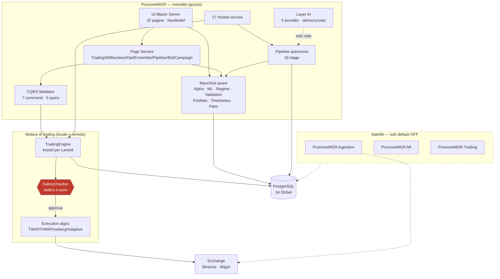
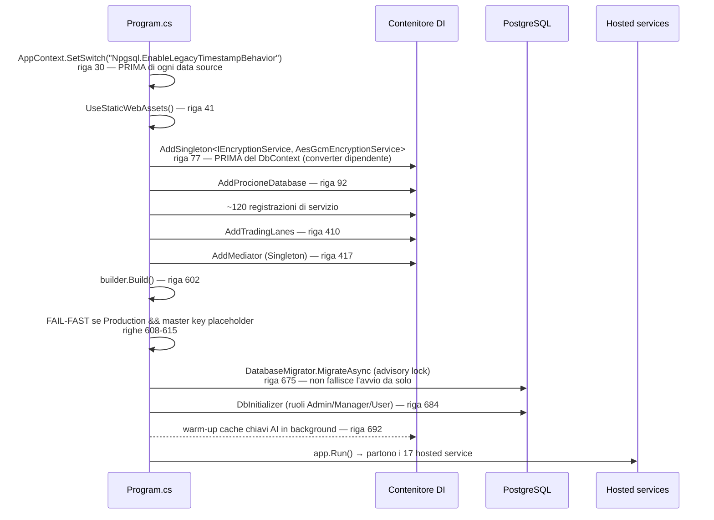
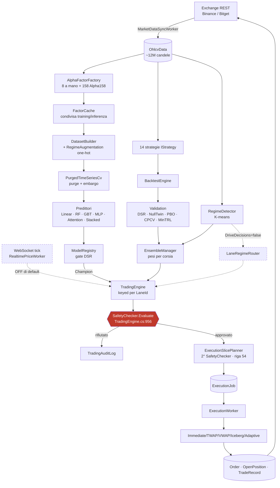
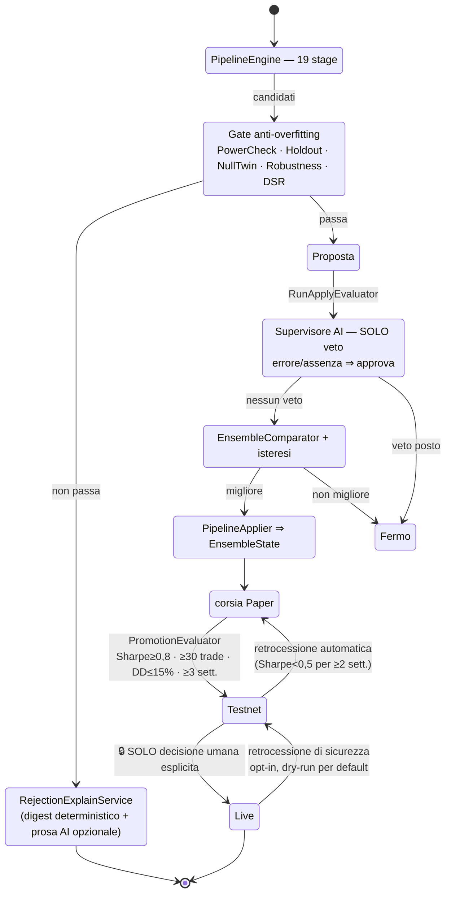

# 02 — ARCHITETTURA AS-IS (reale, non teorica)

Tutto ciò che segue è ricavato dal codice. Dove una cosa **non** è come ci si aspetterebbe, è
segnalato esplicitamente.

---

## 1. La forma reale: monolite modulare con satelliti opzionali

ProcioneMGR **non è** un sistema a microservizi, nonostante esistano 4 host eseguibili. È un
**monolite Blazor Server** (`ProcioneMGR`) che può *delegare* tre responsabilità a servizi separati,
tutte spente per default:

| Delega | Flag | Default | Effetto se acceso |
|---|---|---|---|
| Ingestione OHLCV | `MarketData:UseRemoteIngestion` | `false` | il worker locale non si registra; scrive `ProcioneMGR.Ingestion` |
| Inferenza ML | `Ml:RemoteUrl` valorizzato | vuoto | dual-read **osservativo** verso `ProcioneMGR.Ml` |
| Esecuzione ordini | `Trading:UseRemoteTrading` | `false` | il monolite non registra alcun motore; esegue `ProcioneMGR.Trading` |

> **Il meccanismo di sicurezza centrale non è un lock: è la registrazione condizionale.**
> `TradingServiceCollectionExtensions.cs:109-255` — con `UseRemoteTrading=true` il monolite **non
> registra** `TradingEngine`/`TradingWorker`/`ExecutionWorker`. I due insiemi sono mutuamente
> esclusivi *per costruzione*. Dal 2026-07 si aggiunge un **advisory lock Postgres** per corsia
> (`LaneExecutionLease.cs`) che rende l'invariante applicata dal database, non dalla disciplina.

### Overview generale

---

## 2. Bootstrap e composizione (chi registra cosa)

Due composition root, in quest'ordine:

1. **`ProcioneMGR/Program.cs`** (706 righe) — tutto il resto.
2. **`AddTradingLanes(...)`** in `TradingServiceCollectionExtensions.cs` (riga 410 di `Program.cs`)
   — le corsie, **condivisa verbatim** con l'host `ProcioneMGR.Trading`.

### Sequenza di avvio verificata

**Due fail-fast dichiarati:**
- `Program.cs:608` — in Production non si parte con la master key placeholder del template.
- `TradingServiceCollectionExtensions.cs:118,128` — con `UseRemoteTrading=true` mancano `RemoteUrl`
  o `GrpcSharedSecret` ⇒ eccezione all'avvio ("meglio non partire che partire con un trading muto").

---

## 3. Hosted services: chi gira davvero

17 registrazioni in `Program.cs` + 5 in `AddTradingLanes`. **Il default di ciascuno decide se il
worker fa qualcosa o gira a vuoto**: molti si autospengono leggendo la propria opzione.

| Worker | File | Cadenza / trigger | Attivo per default |
|---|---|---|---|
| `MarketDataSyncWorker` | `Services/Ingestion/` | periodico | ✅ (`MarketData:Enabled=true`) |
| `SeriesFreshnessWatchWorker` | `Services/Ingestion/` | periodico | ✅ sempre nel guscio |
| `ExchangeClockSyncWorker` | `Services/Ingestion/` | periodico | ✅ |
| `RegimeRetrainingWorker` | `Services/Regime/` | periodico | ✅ (`MarketRegime:Enabled=true`) |
| `FactorDriftWorker` | `Services/Alpha/` | periodico | ✅ |
| `SentimentSyncWorker` | `Services/Sentiment/` | periodico | ✅ (`Sentiment:Enabled=true`) |
| `LiquidationSyncWorker` | `Services/MarketData/` | WebSocket continuo | ✅ (`Liquidations:Enabled=true`) |
| `FeatureDriftWorker` | `Services/Monitoring/Drift/` | periodico | ❌ (`Drift:Enabled=false`) |
| `MetricsCollector` | `Services/Observability/` | periodico | ✅ |
| `PipelineSchedulerWorker` | `Services/Pipeline/` | cron + auto-reapply | ✅ (`AutoReapply:Enabled=true`) |
| `CampaignPlannerWorker` | `Services/Pipeline/` | periodico | ❌ (`Campaign:Enabled=false`) |
| `RegimeChangeTriggerWorker` | `Services/Pipeline/` | periodico | ⚠️ acceso ma inerte senza Campaign |
| `LlmUsageFlushWorker` | `Services/Llm/` | periodico | ⚠️ solo con budget tracking |
| `PostMortemWorker` | `Services/Llm/Narration/` | periodico | ❌ (`PostMortem` off) |
| `LlmSupervisorWorker` | `Services/Pipeline/` | periodico | ⚠️ `Llm:Enabled=true` ma serve chiave |
| `DailyDigestWorker` | `Services/Notifications/` | giornaliero | ❌ (`Digest:Enabled=false`) |
| `FleetOrchestratorWorker` | `Services/Fleet/` | periodico | ❌ (`Fleet:Enabled=false`) |
| `PromotionWorker` | `Services/Trading/` | ogni 6 h | ✅ (`AutoPromoteToTestnet=true`) |
| `MasterKeyProbeWorker` | `Services/Trading/` | avvio | ✅ |
| `LaneCountCoherenceProbeWorker` | `Services/Trading/` | avvio | solo con trading remoto |
| `TradingWorker` × N corsie | `Services/Trading/` | per candela | ✅ se motore locale |
| `ExecutionWorker` × N corsie | `Services/Trading/` | per fetta | ✅ se motore locale |
| `EnsembleRebalanceWorker` × N corsie | `Services/Ensemble/` | periodico | ✅ solo nel monolite |
| `LaneInvariantWatchdog` | `Services/Trading/` | periodico | ✅ se motore locale |
| `RealtimePriceWorker` | `Services/MarketData/` | WebSocket | ❌ (`Realtime:Enabled=false`) |
| `CarryWorker` | `Services/Carry/` | periodico | ❌ (`Carry:Enabled=false`) |
| `HostHeartbeatWorker` / `HeartbeatMonitorWorker` | `Services/Health/` | periodico | ❌ (`Heartbeat:Enabled=false`) |

**Pattern ricorrente e deliberato:** il worker è registrato **due volte** — come `IHostedService` e
come singleton risolvibile — così la UI può chiamare `TickAsync()` ("Esegui ora") sulla **stessa
istanza** che gira in background. Usato da `MetricsCollector`, `SentimentSyncWorker`,
`FeatureDriftWorker`, `LiquidationSyncWorker`, `LlmSupervisorWorker`, `FleetOrchestratorWorker`,
`CarryWorker`, `SeriesFreshnessWatchWorker`.

---

## 4. Data flow: dalla candela all'ordine

### Rami che si interrompono (evidenza)

```mermaid
flowchart LR
  subgraph OK["Catena principale — CHIUSA"]
    A1[dati] --> A2[fattori] --> A3[modelli] --> A4[segnali] --> A5[backtest] --> A6[validazione] --> A7[ensemble] --> A8[risk] --> A9[esecuzione] --> A10[tracking] --> A11[promozione]
  end

  subgraph BREAK["Rami interrotti"]
    B1["Microstructure<br/>OFI · tape · IcGate"] -->|"solo CLI"| B2(["tools/PlatformExpand"])
    C1["JumpModel"] -->|"solo test"| C2(["JumpModelTests"])
    D1["MeanVariance<br/>RiskParity"] -->|"solo vista"| D2(["/portfolio"])
    E1["GARCH"] -->|"non validato<br/>per il sizing"| E2(["/volatility"])
    F1["SentimentFeatureFactor"] -->|"EnableMlFeature=false"| F2(["spento"])
  end

  style BREAK fill:#3a1f1f
  style OK fill:#1f3a24
```

---

## 5. Control flow: chi decide e chi può solo suggerire

> **Verificato nel codice:** non esiste alcun percorso che porti automaticamente a `TradingMode.Live`.
> `PromotionEvaluator` conosce solo Paper→Testnet (promozione) e Live→Testnet (retrocessione, con
> `AutoDemoteLiveToTestnet=false` e `DemoteLiveDryRun=true` di default).

---

## 6. UI ↔ services ↔ engine

```mermaid
graph LR
  subgraph U["UI Blazor"]
    P1["/trading"]
    P2["/ml"]
    P3["/backtest"]
    P4["/pipeline"]
    P5["/portfolio"]
    P6["/volatility"]
  end
  subgraph S["Page service (Scoped)"]
    S1[TradingPageService]
    S2[MlLabService]
    S3[BacktestPageService]
    S4[PipelinePageService]
  end
  subgraph M["CQRS"]
    M1["IMediator<br/>7 command · 5 query"]
  end
  subgraph E["Engine"]
    E1["ITradingEngine<br/>keyed LaneId"]
    E2[PipelineEngine]
    E3[BacktestEngine]
    E4["MV · RiskParity · HRP"]
    E5[GarchModel]
  end

  P1 --> S1 --> M1 --> E1
  P2 --> S2 --> E3
  P3 --> S3 --> E3
  P4 --> S4 --> E2
  P5 -->|"iniezione diretta,<br/>nessun page service"| E4
  P6 -->|"iniezione diretta"| E5

  style P5 fill:#4a3a1f
  style P6 fill:#4a3a1f
```

**Due pattern coesistenti, e la differenza conta:**
- **Con page service** (`/trading`, `/ml`, `/backtest`, `/optimization`, `/ensemble`, `/pipeline`,
  `/bot`, `/campaign`): logica testabile senza Blazor, markup sottile. È lo standard dichiarato
  (P1-5, PRD consolidamento §3.3).
- **A iniezione diretta** (`/portfolio`, `/volatility`, `/regimes`, `/pairs-trading`,
  `/market-analysis`, `/sentiment`, `/feature-selection`, …): il `.razor` orchestra da sé. Sono le
  pagine dove la logica **non prosegue** verso l'operatività — ed è esattamente lì che si
  concentrano i rami interrotti del §4.

---

## 7. Configurazione

- **Sorgente**: `appsettings.json` (⚠️ **gitignored e assente da questo worktree**) +
  `appsettings.{Environment}.json` + variabili d'ambiente + User Secrets.
- **Hot-reload**: quasi tutto passa da `IOptionsMonitor<T>` con `reloadOnChange`. `AppConfigWriter`
  fa read-modify-write con lock sul file; la UI di `/admin/autonomy` e `/execution` scrive lì.
- **Config del motore**: con trading remoto **si chiede al motore** (`RemoteEngineConfigStore` via
  gRPC), perché «il suo file non è il nostro» (`EngineConfigStore.cs`).
- **Richiedono riavvio** (non hot-reload): `MarketData:UseRemoteIngestion`, `Trading:UseRemoteTrading`,
  `Ml:RemoteUrl`, `Trading:LaneCount` (congelato alla prima lettura di `TradingLanes.Count`).

---

## 8. Punti di ingresso

| Ingresso | Dove | Autenticazione |
|---|---|---|
| UI Blazor Server | `app.MapRazorComponents<App>()` + `AddInteractiveServerRenderMode()` | Identity cookie, ruoli Admin/Manager/User |
| Identity endpoints | `MapAdditionalIdentityEndpoints()` | — |
| `GET /health` | `Program.cs:654` | **anonimo di proposito** (probe K8s) |
| gRPC `TradingCommandService` | `ProcioneMGR.Trading` | `SharedSecretAuthInterceptor` |
| gRPC `InferenceService` | `ProcioneMGR.Ml` | — |
| CLI | `tools/*` | nessuna |

> **Non esistono controller REST né Minimal API oltre a `/health`.** Non c'è una API pubblica: la UI
> parla con i servizi in-process via DI. Chi cercasse "gli endpoint" non li troverà — è una scelta
> architetturale, non una mancanza.

---

## 9. Event flow / messaggistica

- **Nessun message bus.** `ProcioneMGR.Contracts/Protos/events.proto` esiste ma **non risulta un
  publisher/subscriber attivo**: la comunicazione fra host è gRPC richiesta-risposta + stato condiviso
  su Postgres.
- **CQRS in-process** via Mediator (source-generated), solo lato Blazor. `TradingCommandServiceImpl`
  (host standalone) chiama `ITradingEngine` **direttamente**, per scelta dichiarata.
- **Coordinamento fra host**: `HostHeartbeat` (tabella) + advisory lock Postgres per le corsie.

---

## 10. Cosa è effettivamente cablato e cosa no — sintesi

| Meccanismo | Cablato? | Evidenza |
|---|---|---|
| Alpha158 → pipeline fattori | ✅ | `AlphaFactorFactory.cs:60` |
| IC → selezione feature | ✅ | `IcFeatureSelector` → `/feature-selection`, `FeatureEngineeringStage` |
| Purged CV → training | ✅ | `PurgedTimeSeriesCv` in `MlLabService`, `ModelStages` |
| Walk-forward → ottimizzazione | ✅ | `OptimizationEngine` (755 righe) |
| Regime → ensemble | ✅ | `EnsembleManager` riceve `IRegimeDetector` |
| Regime → routing decisioni | ⚙️ deliberatamente off | `DriveDecisions=false` |
| Discovery → validazione → ensemble | ✅ | stage 9-14 |
| HRP → pesi ensemble | ✅ | `DecisionStages.cs:90` |
| MV / Risk Parity → operatività | ❌ | solo `/portfolio` |
| GARCH → sizing | ⚙️ deliberatamente no | `VolatilityScaler` doc-comment |
| Kelly → risk sizing | ✅ | `ModelStages.cs:590` |
| Monte Carlo → risk sizing | ✅ | `ModelStages.cs:504` |
| Pairs → screening pipeline | ✅ | `PairsScreeningStage` |
| Sentiment → funding/carry | ✅ | `SentimentMetricPoint` → `FundingHistoryProvider`, `CarryWorker` |
| Sentiment → feature ML | ⚙️ off | `EnableMlFeature=false` |
| Nested execution → ordini | ✅ | `TradingEngine` ctor riga 46 → `ExecutionSlicePlanner` |
| SafetyChecker → ordini | ✅ | 2 call site, entrambi sul percorso di apertura |
| Experiment tracker → run | ✅ | 7 punti |
| Concept drift → registry | ✅ | `FeatureDriftWorker.cs:127` |
| Registry Champion → motore | ✅ | `TradingEngine.cs:81`, solo Paper/Testnet |
| Supervisore AI → applica | ✅ solo veto | `RunApplyEvaluator.cs:81-106` |
| Promozione Paper→Testnet | ✅ | `PromotionWorker` |
| Promozione → Live | 🔒 **mai automatica** | per costruzione |
| Microstructure → qualunque cosa | ❌ | zero DI, zero UI |
| JumpModel → regime | ❌ | zero riferimenti |
