# 05 — UI ↔ BACKEND BINDING

89 file `.razor` (22.607 righe), di cui **35 file** in `Components/Pages/` (18.604 righe):
**34 con direttiva `@page`** — 32 pagine funzionali + 2 di sistema (`/Error`, `/not-found`, non
presenti in `NavModel` per progetto) — più `OhlcvChart.razor`, che è un componente senza rotta.
Il resto è layout, condivisi e boilerplate Identity.

---

## 1. Architettura della UI

- **Blazor Server interattivo** (`AddInteractiveServerComponents` + `AddInteractiveServerRenderMode`).
  Nessun WASM, nessun client HTTP verso la propria API: **la UI chiama i servizi in-process via DI**.
- **Autenticazione** Identity con cookie; ruoli `Admin` / `Manager` / `User`
  (`Data/AppRoles.cs`), applicati sia via `AuthorizeView` sia via `NavModel.IsVisible`.
- **Navigazione centralizzata**: `Components/Layout/NavModel.cs` è la **fonte unica** condivisa da
  `NavMenu` (sidebar), `Breadcrumb` e `CommandPalette` (Ctrl+K). Modificare una rotta in un posto
  solo aggiorna tutti e tre.
- **Stato**: nessuno store globale. Ogni pagina tiene il proprio stato nel code-behind; la
  persistenza per utente passa da `IPageConfigStore` → `UserPageConfig`.
- **Aggiornamento**: **polling** (`Components/Shared/PollingTimer.cs`), non SignalR push né WebSocket
  verso il browser. Il circuito Blazor Server è già una connessione persistente: il polling
  aggiorna lo stato lato server e il diff arriva da solo.
- **Riconnessione**: `ReconnectModal.razor` + `.js` gestisce la caduta del circuito.

### Componenti condivisi

| Componente | Ruolo |
|---|---|
| `Shared/Stat.razor` | tessera KPI (valore + etichetta + tono) |
| `Shared/LaneSelector.razor` | selettore di corsia, alimentato da `ILaneDirectory` |
| `Shared/DataAvailability.razor` | dichiara **quanti dati ci sono davvero** prima di lanciare un calcolo |
| `Shared/ConfigPresets.razor` | preset per-utente via `IPageConfigStore` |
| `Shared/AdvancedPanel.razor` | pannello "avanzate" collassabile |
| `Shared/GuidaPanel.razor` | spiegazione in italiano di cosa fa la pagina |
| `Shared/Breadcrumb.razor` | percorso da `NavModel.Resolve()` |
| `Shared/CommandPalette.razor` | ricerca globale Ctrl+K su `NavModel` |
| `Shared/PollingTimer.cs` | timer di aggiornamento |
| `Pages/OhlcvChart.razor` | grafico candele (componente, non pagina) |

> **`DataAvailability` merita una nota:** è il rimedio strutturale alla classe di difetti
> "controlli che rassicurano a prescindere dalla realtà" (audit 2026-07-29/31). Dichiara la copertura
> reale dei dati **prima** che l'utente lanci un calcolo che sarebbe vuoto.

---

## 2. Matrice UI → backend → engine

Colonna **Stato reale**: 🟢 catena completa fino all'operatività · 🟡 catena completa ma si ferma
all'analisi · 🔵 pagina di configurazione/monitoraggio (nessuna catena quant) · 🔴 problema.

| Rotta | Pagina (righe) | Servizi iniettati | Engine raggiunto | Azioni reali | Stato |
|---|---|---|---|---|---|
| `/` | `Home.razor` (288) | `IEnsembleManager`, `FactorDriftSnapshot`, DbFactory | ensemble, alert deriva | naviga | 🔵 |
| `/dashboard` | `Dashboard.razor` (385) | `IOhlcvIngestionService`, `IExchangeClientFactory`, `ITechnicalIndicatorsService`, `IPromotionEvaluator` | ingestion, indicatori | grafici one-off | 🔵 |
| `/market/watchlist` | `Watchlist.razor` (307) | `IMarketDataSyncService` | ingestion (locale o remota) | **aggiungi/rimuovi serie, sync** | 🟢 |
| `/market-analysis` | `MarketAnalysis.razor` (745) | `GapLap`, `Excursion`, `Cyclical`, `CandlestickPatternDetector`, `SupportResistance`, `ChartPatterns`, `Volume`, `IDtwPatternAnalysisService` | 8 analizzatori | analisi | 🟡 |
| `/market/bars` | `InformationBars.razor` (322) | DbFactory, JS | `BarBuilder` | confronto barre | 🟡 |
| `/metrics` | `Metrics.razor` (358) | `MetricsCollector` | observability | — | 🔵 |
| `/backtest` | `Backtest.razor` (832) | `BacktestPageService`, `IStrategyFactory` | `BacktestEngine`, Kelly, Monte Carlo, `PerformanceControl`, `LeverageAdvisor`, meta-labeling, tracker | **esegui, salva strategia, handoff** | 🟢 |
| `/optimization` | `Optimization.razor` (736) | `OptimizationPageService`, `IStrategyFactory` | `OptimizationEngine`, Bayesian, CPCV, tracker | **esegui, applica parametri** | 🟢 |
| `/feature-selection` | `FeatureSelection.razor` (761) | `IIcFeatureSelector`, `IFactorDriftAnalyzer`, `IFactorIcHistoryStore`, `IAlphaFactorFactory` | IC, Alpha158, deriva | **seleziona, salva fattori** | 🟢 |
| `/ml` | `MlLab.razor` (1.021) | `MlLabService`, `IAlphaFactorFactory` | 6 predittori, purged CV, SHAP, registry, tracker | **addestra, salva, promuovi** | 🟢 |
| `/ensemble` | `Ensemble.razor` (761) | `EnsemblePageService`, `ILaneDirectory`, `IStrategyFactory` | `EnsembleManager` keyed, comparator, decay | **ribilancia, applica** | 🟢 |
| `/portfolio` | `PortfolioOptimization.razor` (432) | `MeanVarianceOptimizer`, `RiskParityOptimizer`, `HierarchicalRiskParityOptimizer`, `IRiskFactorPca` | 3 optimizer + PCA | confronta allocazioni | 🟡 **C-05: nessun "applica"** |
| `/registry` | `Registry.razor` (292) | `IModelRegistry` | registry, gate DSR | **promuovi/ritira/riporta in Staging** | 🟢 |
| `/experiments` | `Experiments.razor` (333) | DbFactory | `ExperimentRun`/`Artifact` | consulta, confronta | 🔵 |
| `/bot` | `Bot.razor` (297) | `BotPageService` | profili di rischio → `LaneSafetyMonitor` → motore | **avvia/ferma in modalità semplice** | 🟢 |
| `/trading` | `Trading.razor` (1.574) | `TradingPageService`, `IMasterKeyProbe`, `ILaneDirectory`, `ProtectiveExitDiagnosticsService` | **`ITradingEngine` via 12 messaggi CQRS** | **start/stop, emergency stop, chiudi posizione, SL/TP, conferma/rifiuta ordine** | 🟢 |
| `/strategies` | `Strategies.razor` (137) | DbFactory, Nav | `SavedStrategy` | apri in backtest | 🔵 |
| `/execution` | `ExecutionLab.razor` (315) | `IExecutionAlgorithmFactory`, `IExecutionSimulator`, `IOptionsMonitor<ExecutionParameters>`, `IAppConfigWriter`, tracker | 5 algoritmi + simulatore | **confronta, scrivi parametri di costo (hot-reload)** | 🟢 |
| `/discovery` | `Discovery.razor` (419) | `IStrategyDiscovery`, `IStrategyComposer`, tracker | discovery + composer | **esegui sweep** | 🟢 |
| `/pipeline` | `Pipeline.razor` (705) | `PipelinePageService`, `IPipelineStageCatalog`, `IPipelineRulesProvider` | `PipelineEngine` 19 stage | **avvia run, applica raccomandazione** | 🟢 |
| `/campaign` | `Campaign.razor` (236) | `CampaignPageService` | `CampaignPlanner` | gestisci campagne | 🟡 (planner off) |
| `/alpha-mining` | `AlphaMining.razor` (374) | `GeneticAlphaMiner`, tracker | GP miner | **esegui mining, salva fattori** | 🟢 |
| `/regimes` | `Regimes.razor` (416) | `IRegimeDetector`, `IMarketFeatureExtractor`, `IEnsembleManager`, `IStrategyFactory` | K-means, profili | **addestra modello di regime** | 🟢 |
| `/pairs-trading` | `PairsTrading.razor` (486) | `IPairsBacktestEngine` | Kalman/OLS, cointegrazione | esegui backtest pairs | 🟡 |
| `/volatility` | `Volatility.razor` (288) | `IGarchModel` | GARCH(1,1) | stima e previsione | 🟡 (per decisione) |
| `/sentiment` | `Sentiment.razor` (1.137) | 13 servizi: `IAltDataSyncService`, `INewsImpactAnalyzer`, `SentimentSnapshotCache`, `SentimentSyncWorker`, `SentimentScorerComparisonService`, `OnnxSentimentPilotService`, `IAppConfigWriter`… | sentiment completo | **sync, confronta scorer, addestra pilota ONNX, scrivi config** | 🟡 (feature ML off) |
| `/settings/exchanges` | `ExchangeSettings.razor` (391) | `IExchangeCredentialReader`, `IMasterKeyProbe`, `IExchangeClientFactory` | credenziali cifrate | **salva credenziali, testa connessione** | 🟢 |
| `/admin/ai-supervisor` | `Admin/AiSupervisor.razor` (1.389) | 16 servizi del layer AI | 5 provider, guard, budget, comitato, post-mortem | **configura provider/chiavi, esegui supervisione, secondo parere** | 🟢 |
| `/admin/autonomy` | `Admin/Autonomy.razor` (1.974) | **26 servizi** | auto-reapply, promozioni, drift, sentiment, notifiche, campagne, fleet, heartbeat, digest | **scrive ~20 sezioni di config a caldo + "Esegui ora" su 5 worker** | 🟢 |
| `/admin/protections` | `Admin/Protections.razor` (533) | `IEngineConfigStore`, `IStrategyFactory` | **config del MOTORE** (locale o via gRPC) | **scrive le protezioni del motore** | 🟢 |
| `/admin/users` | `AdminUsers.razor` (140) | `UserManager<ApplicationUser>` | Identity | **gestisci utenti/ruoli** | 🔵 |
| `/admin/backup` | `Admin/Backup.razor` (199) | `DatabaseBackupService` | pg_dump/pg_restore | **backup/restore** | 🔵 |

---

## 3. I due pattern di orchestrazione, e cosa significano

### 3.1 Con page service (standard dichiarato, P1-5)

8 pagine: `/trading`, `/ml`, `/backtest`, `/optimization`, `/ensemble`, `/pipeline`, `/bot`, `/campaign`.

```
Pagina.razor (markup sottile)
   └─> XxxPageService (Scoped, testabile senza Blazor)
         └─> engine / IMediator
```

Sono **tutte** testate senza Blazor: `TradingPageServiceTests`, `MlLabServiceTests`,
`BacktestPageServiceTests`, `OptimizationPageServiceTests`, `EnsemblePageServiceTests`,
`PipelinePageServiceTests`, `BotPageServiceTests`, più i render test
(`BotPageRenderTests`, `ProtectionsPageRenderTests`, `AuditBlazorUiTests`).

### 3.2 A iniezione diretta

Le altre 24. Il `.razor` orchestra da sé.

**La correlazione da notare:** le pagine 🟡 (analisi che non prosegue) sono **quasi tutte** a
iniezione diretta. Non è casuale: dove la catena si ferma all'analisi, non è mai stato scritto un
page service perché non c'era un'azione da orchestrare. Il pattern architetturale **riflette** il
gap funzionale invece di nasconderlo.

---

## 4. Azioni finte, scollegate o mancanti

Verifica specifica sui punti in cui una UI potrebbe "rassicurare senza fare".

| Punto | Verdetto | Evidenza |
|---|---|---|
| `/portfolio` — bottone "applica allocazione" | ❌ **assente** (non finto: proprio non c'è) | i 3 optimizer sono iniettati per il solo confronto; nessun percorso di scrittura |
| `/execution` — pannello "Modello di costo" | ✅ **reale e a caldo** | `IOptionsMonitor<ExecutionParameters>` scelto **apposta**: con un POCO catturato al boot il pannello «sembrerebbe funzionare e non cambierebbe nulla» (`Program.cs:178-181`) |
| `/admin/protections` — protezioni del motore | ✅ **reale anche in remoto** | `IEngineConfigStore`: con trading remoto **si chiede al motore**, perché «il suo file non è il nostro» |
| `/admin/autonomy` — "Esegui ora" | ✅ **reale** | i worker sono registrati anche come singleton risolvibili ⇒ la UI chiama `TickAsync()` sulla **stessa istanza** del hosted service |
| `/sentiment` — "Esegui sync ora" | ✅ **reale** | stesso pattern (`Program.cs:299-301`) |
| `/trading` — comandi di corsia | ✅ **reali** | 12 messaggi CQRS → `ITradingEngine` keyed |
| Feed real-time in `/admin/protections` | ⚠️ **pannello vivo, feature spenta** | il binding delle opzioni è incondizionato apposta, così il pannello mostra lo stato **vero** anche col motore remoto. Ma vedi C-02 |
| Alert di deriva in Home | ✅ reale | `FactorDriftSnapshot` aggiornato da `FactorDriftWorker` |

> **Conclusione onesta:** non ho trovato **nessun** controllo finto. La piattaforma ha già subito una
> campagna specifica contro questa classe di difetti (Filone E, 2026-07-31, 7 istanze corrette) e il
> risultato regge. L'unico caso ambiguo è il pannello del feed real-time, che è vivo su una feature
> spenta — corretto come progetto, ma pericoloso per via di C-02.

---

## 5. Dati e contratti mancanti

| Mancanza | Impatto | Rif. |
|---|---|---|
| Nessun DTO fra UI e servizi: le pagine consumano **direttamente** i modelli di dominio | accoppiamento UI↔dominio; cambiare un modello rompe il markup | G-13 |
| Nessun contratto per "applica allocazione di portafoglio" | C-05 non è risolvibile senza inventarlo | C-05 |
| Nessuna UI per Microstructure | 1.166 righe irraggiungibili | C-03 |
| Nessuna UI per `JumpModel` | modello di regime alternativo invisibile | C-04 |
| Nessuna pagina espone la **deriva dei fattori Alpha158** | l'esclusione dal monitor è invisibile all'operatore | G-04 |

---

## 6. Livello di completezza per pagina

| Livello | Pagine | Conteggio |
|---|---|---|
| **Completa** (mostra + agisce + persiste) | `/trading`, `/ml`, `/backtest`, `/optimization`, `/ensemble`, `/pipeline`, `/bot`, `/discovery`, `/alpha-mining`, `/feature-selection`, `/registry`, `/regimes`, `/execution`, `/market/watchlist`, `/settings/exchanges`, `/admin/autonomy`, `/admin/ai-supervisor`, `/admin/protections` | 18 |
| **Analisi** (mostra, non agisce — per progetto o per gap) | `/portfolio`, `/volatility`, `/pairs-trading`, `/market-analysis`, `/market/bars`, `/sentiment`, `/campaign` | 7 |
| **Consultazione / amministrazione** | `/`, `/dashboard`, `/metrics`, `/experiments`, `/strategies`, `/admin/users`, `/admin/backup` | 7 |

**Nessuna pagina risulta rotta, stub o non raggiungibile.**

---

## 7. Riepilogo del binding UI ↔ macchina

```mermaid
graph TB
  subgraph L1["🟢 Catena completa fino all'operatività — 18 pagine"]
    A["/trading · /bot · /ensemble · /pipeline<br/>/ml · /backtest · /optimization · /registry<br/>/discovery · /alpha-mining · /feature-selection<br/>/regimes · /execution · /market/watchlist<br/>/settings/exchanges · /admin/*"]
  end
  subgraph L2["🟡 Si ferma all'analisi — 7 pagine"]
    B["/portfolio ← C-05 gap vero<br/>/volatility ← deliberato<br/>/pairs-trading · /market-analysis<br/>/market/bars · /sentiment ← feature ML off<br/>/campaign ← planner off"]
  end
  subgraph L3["🔵 Consultazione — 7 pagine"]
    C["/ · /dashboard · /metrics · /experiments<br/>/strategies · /admin/users · /admin/backup"]
  end
  subgraph L4["⚫ Senza UI — codice irraggiungibile"]
    D["Services/Microstructure/ — 1.166 righe<br/>Regime/JumpModel.cs — 288 righe"]
  end

  style L1 fill:#1f3a24
  style L2 fill:#4a3a1f
  style L3 fill:#1f2b3a
  style L4 fill:#3a1f1f
```



**La risposta alla domanda «UI e macchina sono sconnesse?» è: no, tranne in quattro punti precisi**
— `/portfolio` senza applica, sentiment→feature ML spento, Microstructure senza UI, `JumpModel` senza
niente. Tutto il resto è cablato, e in diversi casi (page service, `IOptionsMonitor` sui pannelli,
worker risolvibili per "Esegui ora") è cablato **meglio** della media.
