# 07 — BLUEPRINT DI RICOSTRUZIONE

> **Premessa che cambia la natura di questo documento.**
> L'incarico chiedeva una proposta di architettura futura. L'analisi dice che **una riscrittura
> sarebbe un errore**: la piattaforma ha 72.824 righe di produzione con 53.700 righe di test, catene
> critiche verificate chiuse, e commenti che documentano il *perché* di ogni scelta — inclusi gli
> esiti negativi. Riscrivere significherebbe buttare via la parte più costosa e meno replicabile del
> patrimonio: **le decisioni motivate da misure**.
>
> Quello che segue è quindi un blueprint di **consolidamento a invarianti fisse**, non di rifacimento.
> Dove propongo di riscrivere lo dico esplicitamente e ne motivo il perché.

---

## 1. Architettura target

La forma resta quella attuale — **monolite modulare con satelliti opzionali** — con tre correzioni
strutturali:

```mermaid
graph TB
  subgraph L0["Livello 0 — INVARIANTI (immutabili)"]
    INV["SafetyChecker statico e puro<br/>Un solo scrittore per corsia (lease Postgres)<br/>Nessun percorso automatico verso Live<br/>Fail-closed su sicurezza, fail-open su diagnostica<br/>Degradare dicendolo"]
  end

  subgraph L1["Livello 1 — CONTRATTI DI DOMINIO (nuovo)"]
    C1["IRegimeModel"]
    C2["IPortfolioOptimizer risolto per nome"]
    C3["IDataQualityGate"]
    C4["IFactorGate (IC incrementale)"]
    C5["RunSeed propagato"]
  end

  subgraph L2["Livello 2 — DATI E FEATURE"]
    D1["Ingestion OHLCV"]
    D2["Microstructure — INTEGRATA o RIMOSSA"]
    D3["AltData / Sentiment"]
    D4["AlphaFactorFactory<br/>8 a mano + Alpha158 + sentiment + OFI"]
  end

  subgraph L3["Livello 3 — RICERCA"]
    R1["ML: 6 predittori + SHAP + meta-labeling"]
    R2["Validation: DSR · NullTwin · PBO · CPCV · MinTRL · GatePower"]
    R3["Discovery + Composer + GP miner"]
    R4["Backtest + Optimization walk-forward"]
  end

  subgraph L4["Livello 4 — DECISIONE"]
    E1["Ensemble regime-aware"]
    E2["Portfolio: MV / RP / HRP<br/>scelto da configurazione"]
    E3["Risk: Kelly · MonteCarlo · CorrelatedExposure · profili"]
  end

  subgraph L5["Livello 5 — ESECUZIONE"]
    X1["TradingEngine keyed per corsia"]
    X2["SafetyChecker ×2 call site"]
    X3["Nested execution: Immediate/TWAP/VWAP/Iceberg/Adaptive"]
    X4["Paper → Testnet automatico · Live SOLO umano"]
  end

  subgraph L6["Livello 6 — GOVERNO"]
    G1["ExperimentTracker + RunSeed"]
    G2["Drift PSI/KS/PageHinkley → Registry → retrain"]
    G3["Supervisore AI: solo veto"]
    G4["Observability + Digest"]
  end

  L0 -.vincola tutto.-> L5
  L1 --> L2 --> L3 --> L4 --> L5
  L6 -.osserva.-> L3
  L6 -.osserva.-> L5

  style L0 fill:#c0392b,color:#fff
  style L1 fill:#1f3a5a
```

### Le tre correzioni strutturali

| # | Correzione | Perché |
|---|---|---|
| **1** | **Livello 1 esplicito**: 5 contratti che oggi mancano o sono cablati come tipi concreti | è la causa radice di C-04, C-05, G-08, G-11, G-16: ogni volta che manca un contratto, la scelta finisce cablata nel codice e sparisce dalla UI |
| **2** | **Una sola porta verso l'operatività**: `PipelineApplier` | esiste già ed è l'unica implementazione di "Applica al Trading". Va **dichiarata** come unica porta, così ogni nuova funzionalità (es. applicare un'allocazione) sa dove passare — e passa per i gate |
| **3** | **Microstructure dentro o fuori** | non c'è una terza opzione che abbia valore |

### Confini fra moduli (regole da rispettare)

| Regola | Motivo |
|---|---|
| `Services/Llm/` non importa nulla che esegua | regola 6 — il layer AI dà pareri e veti |
| `Services/Ensemble/` non importa `Services/Trading/` | già rispettata: la fee viva è passata come `Func<decimal>` (`TradingServiceCollectionExtensions.cs:187`) |
| Ogni **scrittore** ha esattamente un host | regola della Fase 2b microservizi |
| `Services/Validation/` non dipende da nulla di operativo | è il giudice: deve poter girare anche da CLI |
| La UI non parla mai direttamente al motore | passa da page service → CQRS |

---

## 2. Cosa riusare, riscrivere, eliminare, consolidare

### Riusare invariato (nessuna modifica)

`SafetyChecker` · `SafetyConfiguration` · `LaneSafetyMonitor` · `LaneExecutionLease` ·
`LaneInvariantWatchdog` · `FillSanityCheck` · `PromotionEvaluator`/`LanePromoter`/`PromotionWorker` ·
`TradingEngine` e tutto `Trading/Internal/` · `Execution/*` · `BacktestEngine` + 14 strategie ·
`Validation/*` · `ExperimentTracker` · `Monitoring/Drift/*` · `ModelRegistry` ·
`Alpha/*` (incl. `Alpha158`) · `ML/*` · `Ingestion/*` · `Exchanges/*` · CQRS `Commands`/`Queries` ·
page service esistenti · `NavModel` · layer AI.

**È l'85% del codice.**

### Consolidare (lavoro contenuto, invarianti immutate)

| Cosa | Intervento |
|---|---|
| Portfolio | `IPortfolioOptimizer` risolto per nome in `EnsembleAssemblyStage` (C-05) |
| Regime | `IRegimeModel` con K-means (default) e Jump (C-04) |
| Determinismo | `RunSeed` propagato + fix dei 3 `new Random(42)` (G-08) |
| Deriva fattori | sorvegliare gli Alpha158 **selezionati**, non tutti (G-04) |
| Sentiment | `DataAvailability` sulla copertura temporale, poi accendere `EnableMlFeature` (C-06) |
| Qualità dati | `DataQualityReport` come artefatto di `DataIngestionStage` (G-11) |
| Gate condivisi CLI↔pipeline | estendere il pattern di `NullTwinJudge` a PowerCheck, DSR, costi (G-09) |

### Riscrivere (uno solo, e non è codice di dominio)

`tools/PlatformExpand/Program.cs` — 5.848 righe in un file. **Non** riscrivere la logica: spezzarla
per fase e farla appoggiare sui gate condivisi. È l'unico punto dove la struttura ostacola
davvero la manutenzione.

### Eliminare

`JumpModel` **se** si decide di non integrarlo (ma i test suggeriscono il contrario) ·
`ICombinatorialPurgedCv` (G-07) · `events.proto` se resta senza uso (G-14) ·
🔴 `appsettings.json.pre-audit-test-20260729-141448` (C-01, **subito**).

---

## 3. Fasi di ricostruzione

Ogni fase ha: obiettivo · moduli · acceptance criteria · test minimi · rischi.
Le fasi 0 e 1 sono **prerequisiti bloccanti**; dalla 2 in poi si può procedere in parallelo.

Ogni fase rispetta `docs/STANDARD-VERIFICA.md` (4 livelli: unità vs riferimento indipendente ·
controllo sul rumore · integrazione reale · browser).

---

### Fase 0 — Invarianti e sicurezza 🔴 BLOCCANTE

**Obiettivo.** Chiudere l'esposizione dei segreti e allineare i default alle misure. Nessuna riga di
logica di dominio cambia.

**Moduli.** `.gitignore` · `appsettings.json.example` · `Services/MarketData/RealtimeMarketDataModels.cs` ·
script K8s dei Secret.

**Interventi.**
1. `git rm --cached` del file di backup; pattern `.gitignore` per la **famiglia** `appsettings.json.*`.
2. Rotazione di master key, segreto gRPC, password Postgres (+ ri-cifratura delle credenziali exchange).
3. `DriveProtectiveExits` default → `false`, in classe e in example, con citazione del report B3.
4. Test che **asseriscono i default di sicurezza**, così le regole di `CLAUDE.md` smettono di vivere
   solo in un `.md`.

**Acceptance criteria.**
- [ ] `git ls-files | grep -E "appsettings\.json\."` restituisce solo `.example`
- [ ] nessun segreto valorizzato in alcun file tracciato (verifica automatica in CI)
- [ ] `new RealtimeFeedOptions().DriveProtectiveExits == false`
- [ ] le credenziali exchange esistenti si decifrano con la **nuova** master key
- [ ] `MasterKeyProbe` all'avvio non segnala anomalie

**Test minimi.** `SecurityDefaultsTests` (nuovo): default di `RealtimeFeedOptions`,
`PromotionEvaluatorOptions.AutoDemoteLiveToTestnet == false`, `DemoteLiveDryRun == true`,
`RequireManualConfirmationForLive == true`, `CarryMode` non contiene `Live`.
Più `MasterKeyGuardTests`, `ExchangeCredentialReaderTests` (esistenti) verdi con la nuova chiave.

**Rischi.** La rotazione della master key **rende illeggibili le credenziali esistenti** se la
ri-cifratura fallisce → fare backup del DB prima (`/admin/backup` esiste già) e procedere con l'app
ferma.

---

### Fase 1 — Contratti di dominio

**Obiettivo.** Introdurre i 5 contratti mancanti **senza cambiare comportamento**: ogni default
riproduce esattamente l'assetto odierno.

**Moduli.** `Services/Regime/`, `Services/Portfolio/`, `Services/Pipeline/`, `Services/ML/`.

**Interventi.**
| Contratto | Default che preserva il comportamento |
|---|---|
| `IRegimeModel` | `KMeans` (= `RegimeDetector` attuale) |
| `IPortfolioOptimizer` risolto per nome | `HRP` (= cablatura attuale di `DecisionStages.cs:90`) |
| `IDataQualityGate` | produce un report, **non blocca** |
| `IFactorGate` | pass-through (nessun filtro) |
| `RunSeed` in `PipelineContext` + `ExperimentRun` | seed corrente per componente |

**Acceptance criteria.**
- [ ] `dotnet test` verde senza modifiche ai test esistenti
- [ ] un run di pipeline con configurazione di default produce **gli stessi artefatti** di prima
      (confronto byte-per-byte sui numeri, non sui timestamp)
- [ ] `RunSeed` compare in `ExperimentRun` ed è sufficiente a riprodurre il run

**Test minimi.** `ContractDefaultsTests`: risolvendo per nome i default si ottengono le stesse
istanze concrete di oggi. `RunSeedPropagationTests`: due run con lo stesso seed danno risultati
identici; con seed diversi, diversi.

**Rischi.** Bassi. È l'unica fase che tocca molti file con modifiche piccole: rischio di merge, non
di comportamento.

---

### Fase 2 — Dati e feature

**Obiettivo.** Decidere su Microstructure, chiudere G-04 e G-11, valutare C-06.

**Moduli.** `Services/Microstructure/`, `Services/Alpha/`, `Services/Ingestion/`,
`Services/Sentiment/`, `Stages/DataStages.cs`.

**Interventi.**
1. **Decisione Microstructure** (vedi C-03): integrare — DI + `MicrostructureIngestionStage` +
   persistenza `TapeBar` + `IncrementalIcGate` esposto in `/feature-selection` — oppure spostare
   sotto `tools/`. **Serve una decisione umana esplicita: vedi Q4.**
2. `DataQualityReport` come artefatto di `DataIngestionStage`.
3. Deriva sorvegliata sui soli Alpha158 **selezionati**.
4. `DataAvailability` dichiara la copertura temporale del sentiment; solo allora si valuta
   `EnableMlFeature`.

**Acceptance criteria.**
- [ ] nessun file in `Services/` senza registrazione DI **né** dichiarato CLI-only
- [ ] ogni run di pipeline allega un `DataQualityReport`
- [ ] la deriva di un fattore Alpha158 in uso produce un alert visibile in `/feature-selection`
- [ ] se Microstructure è integrata: `IncrementalIcGate` scarta almeno un fattore ridondante su un
      caso costruito

**Test minimi.** `DataQualityGateTests`, `Alpha158DriftTests`,
`IncrementalIcGateIntegrationTests` (se integrato). Livello 3 dello standard: verifica su serie reale.

**Rischi.** 🔴 Accendere il sentiment come feature ML **su finestre non coperte** falsa ogni confronto
storico. Mitigato dal punto 4, che è prerequisito.

---

### Fase 3 — ML e backtest

**Obiettivo.** Chiudere il rischio metodologico più serio (G-15) e completare il determinismo.

**Moduli.** `Services/ML/`, `Services/Validation/`, `Services/Backtesting/`, `Stages/ModelStages.cs`.

**Interventi.**
1. **Verificare e, se serve, correggere il leakage di selezione**: la selezione IC deve avvenire
   **dentro** ogni fold di training.
2. Filtrare `seed` nei 3 punti cablati.
3. Rimuovere `ICombinatorialPurgedCv` o onorarla.
4. Rinominare l'etichetta "LightGBM" → «Gradient Boosting (FastTree)».

**Acceptance criteria.**
- [ ] test che dimostra che **le feature selezionate cambiano fra fold**
- [ ] due run con seed diversi mostrano varianza non nulla su tutti i predittori stocastici
- [ ] se la correzione del leakage abbassa gli Sharpe storici: **è il risultato atteso e va
      documentato**, non nascosto

**Test minimi.** `SelectionLeakageTests` (nuovo, il più importante della fase),
`MlDeterminismTests` esteso ai 3 punti, `AuditCvLeakageTests` (esistente) verde.

**Rischi.** 🟠 Alto sul morale, non sul codice: se G-15 è confermato, **tutti i risultati storici
prodotti con selezione IC vanno riqualificati come ottimistici**. È esattamente il tipo di verità
che questa piattaforma ha già dimostrato di saper accettare (vedi i dieci esiti negativi documentati).

---

### Fase 4 — Strategia, portafoglio, rischio

**Obiettivo.** Chiudere C-05 e rendere selezionabile il modello di regime.

**Moduli.** `Services/Portfolio/`, `Services/Ensemble/`, `Services/Regime/`,
`Stages/DecisionStages.cs`, `/portfolio`, `/pipeline`.

**Interventi.**
1. `EnsembleAssemblyStage` usa `IPortfolioOptimizer` per nome (`Pipeline:PortfolioOptimizer`, default `HRP`).
2. `/pipeline` espone la scelta; `/portfolio` offre «usa questa allocazione nel prossimo run»
   (scrive il parametro — **non** un percorso diretto verso l'esecuzione).
3. `MarketRegime:Model` sceglie fra `KMeans` e `Jump`; misurare in parallelo per un ciclo.

**Acceptance criteria.**
- [ ] cambiare `Pipeline:PortfolioOptimizer` cambia **davvero** i pesi dell'ensemble proposto
- [ ] con `HRP` i pesi sono **identici** a quelli di oggi
- [ ] `/portfolio` non offre alcun percorso che salti i gate della pipeline
- [ ] `JumpRegimeModel` produce meno transizioni di `KMeansRegimeModel` sulla stessa serie

**Test minimi.** `PortfolioOptimizerSelectionTests`, `EnsembleAssemblyWeightsRegressionTests`
(HRP invariato), `RegimeModelSelectionTests`.

**Rischi.** 🟡 Cambiare l'allocatore cambia i pesi delle corsie vive. **Applicare solo a corsie nuove
o dopo uno stop esplicito**, mai a caldo su una corsia con posizioni aperte.

---

### Fase 5 — Esecuzione, sicurezza, Paper→Testnet

**Obiettivo.** **Nessuna modifica funzionale.** Solo rendere le invarianti *verificate da test*
invece che *documentate in prosa*.

**Moduli.** `Services/Trading/`, `Services/Execution/`, `Services/Carry/`.

**Interventi.**
1. Test che asseriscono ogni invariante di `CLAUDE.md`:
   - `SafetyChecker` non è risolvibile dal contenitore DI
   - nessun percorso di codice porta `TradingMode` a `Live` senza input umano
   - `CarryMode` non contiene `Live`
   - con `UseRemoteTrading=true` non è registrato alcun `TradingWorker` locale
     (già coperto da `TradingServiceCollectionExtensionsTests`)
2. Documentare esplicitamente che `PositionCloser` salta l'anti-spam n.6, con il perché.

**Acceptance criteria.**
- [ ] ogni regola delle "sette da non violare" ha almeno un test che fallirebbe se violata
- [ ] `dotnet test` verde
- [ ] verifica di livello 3 (integrazione reale): una corsia Paper gira un ciclo completo

**Test minimi.** `InvariantEnforcementTests` (nuovo). È il documento eseguibile delle regole.

**Rischi.** Nessuno funzionale. Se un test fallisce subito, ha trovato un difetto vero — ed è il
motivo per scriverlo.

---

### Fase 6 — Orchestrazione UI

**Obiettivo.** Portare le pagine 🟡 al livello delle 🟢 dove ha senso, ed estendere il pattern page
service.

**Moduli.** `Components/Pages/`, nuovi page service.

**Interventi.**
1. Page service per `/portfolio` (ora ha un'azione: scegliere l'allocatore).
2. `DataAvailability` su tutte le pagine che lanciano calcoli.
3. Se Microstructure è integrata: sezione in `/feature-selection`.
4. In `/admin/protections`, accanto a ogni interruttore, **l'esito della misura** che ne ha deciso il
   default (a partire da `DriveProtectiveExits`).

**Acceptance criteria.**
- [ ] ogni pagina con azioni ha un page service testabile senza Blazor
- [ ] nessun controllo che sembri agire senza agire (verifica di livello 4: browser)
- [ ] ogni interruttore di sicurezza mostra il perché del suo default

**Test minimi.** Estendere `AuditBlazorUiTests`; render test per le pagine nuove.

**Rischi.** Bassi.

---

### Fase 7 — Osservabilità, drift, governo

**Obiettivo.** Accendere ciò che è pronto e spento, con la gradualità che la piattaforma già usa.

**Moduli.** `Services/Monitoring/Drift/`, `Services/Observability/`, `Services/Notifications/`,
`Services/Experiments/`.

**Interventi.**
1. Accendere `Drift:Enabled` — prima in **sola segnalazione** (`RetireChampionOnAlert=false`), poi,
   dopo un ciclo di osservazione, il ciclo chiuso. È lo stesso schema "osserva prima di decidere"
   già usato per il feed real-time e il dual-read ML.
2. `RunSeed` + `DataQualityReport` allegati a ogni `ExperimentRun`.
3. Valutare `Observability:Enabled` e il digest giornaliero (la cui **assenza** all'ora attesa è il
   dead-man's switch percepibile dall'umano).

**Acceptance criteria.**
- [ ] un drift indotto artificialmente produce un alert visibile in `/admin/autonomy`
- [ ] con `RetireChampionOnAlert=false` **nessun** modello viene ritirato
- [ ] ogni `ExperimentRun` è riproducibile dal solo artefatto

**Test minimi.** `DriftDetectorTests` (esistenti), `FeatureDriftWorkerPersistenceTests` (esistente),
`ExperimentReproducibilityTests` (nuovo).

**Rischi.** 🟡 Accendere il ciclo chiuso del drift **ritira modelli in automatico**. Il passaggio
graduale del punto 1 è obbligatorio, non opzionale.

---

## 4. Quadro delle fasi

| Fase | Blocca | Rischio | Valore | Priorità |
|---|---|---|---|---|
| 0 — Invarianti e sicurezza | tutto | basso | **critico** | 🔴 subito |
| 1 — Contratti | 2,4 | basso | alto | 🔴 alta |
| 2 — Dati e feature | 3 | medio | alto | 🟠 |
| 3 — ML e backtest | — | **alto (verità scomode)** | **critico** | 🟠 alta |
| 4 — Strategia/portafoglio | — | medio | medio | 🟡 |
| 5 — Esecuzione e sicurezza | — | nullo | alto | 🟠 alta |
| 6 — UI | 4 | basso | medio | 🟡 |
| 7 — Governo | 2 | medio | alto | 🟡 |

**Percorso minimo consigliato:** 0 → 1 → 5 → 3. Sono le quattro che danno più sicurezza e più
verità con meno rischio. Le altre seguono.

---

## 5. Vincoli di sicurezza che nessuna fase viola

1. **Nessun percorso automatico verso Live.** Nessuna proposta introduce automazione verso Live.
   L'unica automazione ammessa che tocca una corsia Live resta la **retrocessione** a Testnet,
   opt-in (`AutoDemoteLiveToTestnet=false`) e in dry-run (`DemoteLiveDryRun=true`).
2. **La promozione resta Paper → Testnet → (umano) → Live.**
3. **`SafetyChecker` resta statico e puro**, con i suoi due call site sul percorso che apre esposizione.
4. **Un solo scrittore per corsia**, garantito da registrazione condizionale **e** advisory lock Postgres.
5. **Fail-closed sulla sicurezza, fail-open sulla diagnostica.** Il `DataQualityGate` proposto
   dichiara e non blocca, coerentemente.
6. **Degradare dicendolo.** Ogni nuovo indicatore proposto dichiara la propria freschezza.
